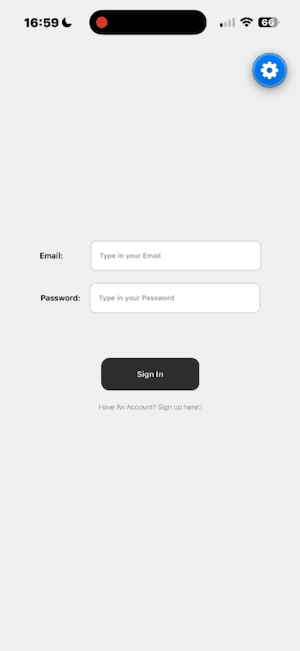
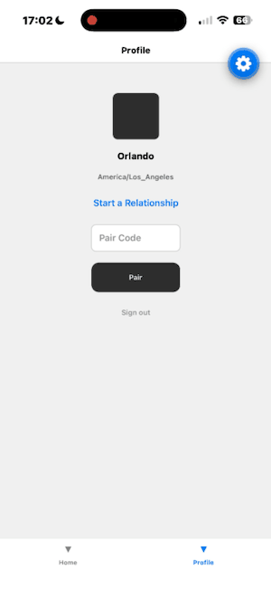
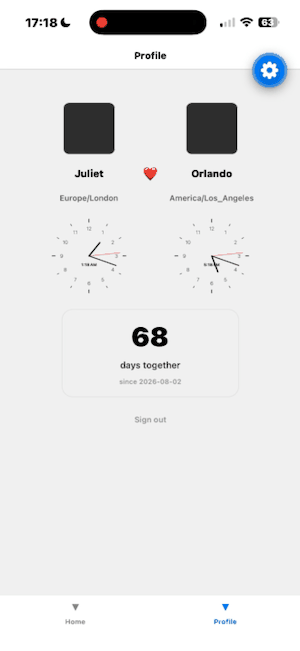
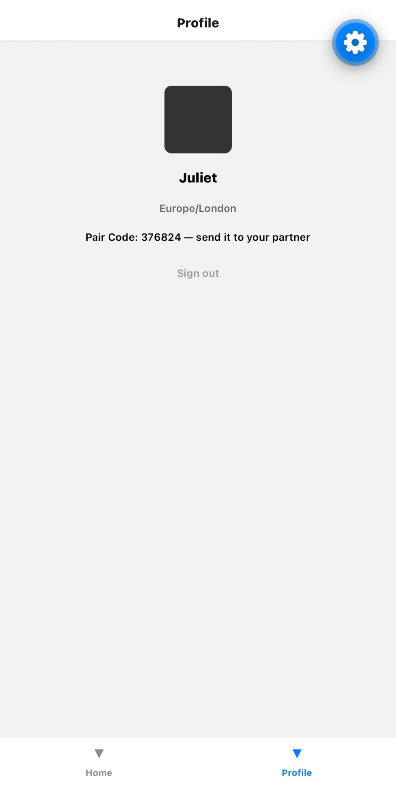

# LDR App — a private shared space for long-distance couples

> 🚧 **Still under active development.** The core experience works end to end on iOS (sign-up, pairing, two live clocks, a shared photo and letter timeline). The calendar and the "best time to call" algorithm are in progress. This README describes only what works today and what is planned next.

Long-distance couples live in two time zones and two separate days. This app gives a paired couple one private space: each person's local time at a glance, how long they have been together, and a shared timeline of photos and letters that only the two of them can see.

## Demo

<table>
  <tr>
    <td align="center"><b>1 · Sign up</b></td>
    <td align="center"><b>2 · Pair, see both clocks, set the start date</b></td>
    <td align="center"><b>3 · A shared timeline of photos and letters</b></td>
  </tr>
  <tr>
    <td></td>
    <td></td>
    <td></td>
  </tr>
</table>

*Demo couple: Orlando in Los Angeles and Juliet in London, 8 hours apart.*

## What works today

| Feature | Details |
|---|---|
| **Accounts** | Email sign-up / sign-in (Supabase Auth). The name is entered at sign-up; the time zone is **detected from the device** as an IANA name. The session is saved to disk, so the app stays signed in across restarts. |
| **Pairing** | One partner creates a 6-character code, the other enters it. Pairing runs in a single database transaction that rejects invalid codes, already-paired users, and a third member. |
| **Profile** | Both partners side by side: names, time zones, and **two ticking analog clocks** each showing its owner's local time. A start-date picker and a **"N days together"** counter. |
| **Timeline** | Share a **photo with an optional caption** or write a **letter**. Moments appear newest first, mine on the right and my partner's on the left. Photos live in **private storage** and are shown through short-lived signed URLs. |
| **Privacy** | Enforced in the database with **Row Level Security**, not in the app: a couple's profiles, start date, moments, and photo files are readable only by its two members. |

<p align="center"></p>

## Engineering highlights

**Correct time across time zones and daylight saving.** Each person's zone is stored as an IANA name (`America/Los_Angeles`, `Europe/London`), never as a fixed offset like `UTC−8`, because offsets change with daylight saving and on different dates in different countries. The analog clocks read hours, minutes, and seconds *in a given zone* with `Intl.DateTimeFormat#formatToParts` and turn them into hand angles in a pure function (`clockAngles`). The days-together counter compares calendar dates at **UTC midnight**, so a 23-hour daylight-saving day can't produce an off-by-one.

**Security in the database, not the UI.** The app ships only the public (publishable) key, so every rule that matters lives in Postgres:
- **Row Level Security** on every table: a helper function `my_couple_id()` (security definer, to avoid policy recursion) lets each policy say "only rows in my couple".
- **Column-level grants**: users can update only their own `name` and `timezone`; couples can update only `start_date`. The column that grants access, `couple_id`, can never be written by the app.
- **Pairing as a database function** (`join_couple`): the checks and the write happen in one transaction, and `select … for update` locks the couple row so two people entering the same code at the same moment can't both join.
- **Private storage**: photos are stored under `<couple_id>/…`, and storage policies check that folder against the requester's couple.

**Profiles created atomically.** A trigger on `auth.users` creates the profile row in the same transaction as the account, so every account is guaranteed a profile.

The complete database — tables, constraints, functions, trigger, grants, and policies — is in [`supabase/schema.sql`](supabase/schema.sql).

## Tech stack

| Layer | Choice | Why |
|---|---|---|
| App | React Native + Expo (SDK 57), TypeScript | One codebase for iOS and Android; types catch errors before the app runs |
| Navigation | Expo Router | File-based routing: a root stack for sign-in and a modal composer, tabs for Home and Profile |
| Graphics | `react-native-svg` | The analog clocks are drawn as SVG: ticks, upright numbers, and hands rotated around the center |
| Backend | Supabase: PostgreSQL, Auth, Storage | No custom server; relational data fits users → couples → moments; Row Level Security keeps each couple's data private |

## Data model

```
auth.users   (Supabase Auth: email, password hash)
   │ 1:1 — profile created by a trigger at sign-up
   ▼
users        (id, name, timezone, couple_id)
   │ many:1 — couple_id set only by the pairing functions
   ▼
couples      (id, pair_code, start_date)
   │ 1:many
   ▼
moments      (id, couple_id, author_id, kind: photo | letter, storage_path, body, created_at)
                └── photo files in the private "photos" bucket, at <couple_id>/<timestamp>.<ext>
```

Photos and letters share one `moments` table, so the timeline is a single query ordered by time.

## Project structure

```
src/
├── app/                    # screens (Expo Router: every file is a route)
│   ├── _layout.tsx         # root Stack: sign-in, tabs, and the "New moment" modal
│   ├── index.tsx           # sign in / sign up; skips straight to Home if a session is saved
│   ├── new-moment.tsx      # share a photo with a caption, or write a letter
│   └── (tabs)/
│       ├── _layout.tsx     # Tabs: Home, Profile
│       ├── home.tsx        # the shared timeline
│       └── profile.tsx     # pairing, both partners, clocks, days together
├── components/
│   └── AnalogClock.tsx     # SVG clock for any IANA time zone
└── lib/
    ├── supabase.ts         # the shared Supabase client (session saved with AsyncStorage)
    └── time.ts             # formatTime, clockAngles, daysTogether — pure functions
supabase/
└── schema.sql              # the whole database as code
```

## Run it locally

Requires Node.js, the Expo Go app on your phone, and a Supabase project.

1. **Database:** in a new Supabase project, open the SQL Editor and run [`supabase/schema.sql`](supabase/schema.sql). For development, turn off **Authentication → Sign In / Providers → Email → Confirm email**.
2. **Keys:** create `.env.local` in the project root (it is git-ignored):

   ```
   EXPO_PUBLIC_SUPABASE_URL=https://<your-project>.supabase.co
   EXPO_PUBLIC_SUPABASE_KEY=<your publishable key>
   ```

   Only the **publishable** key belongs in the app. Never put a secret / service-role key here.

3. **Start:**

   ```bash
   npm install
   npx expo start
   ```

4. Scan the QR code with your phone camera (iOS) or the Expo Go app (Android).

Tested on iOS. Android is supported by the codebase (including a platform-specific date picker) but has not been tested on a device yet.

## In progress / next

- **Calendar:** each partner records busy times, including recurring ones (daily, or weekly on chosen days), shown in both local times.
- **Best time to call:** a pure function that expands recurring busy times per time zone, merges each person's intervals, and intersects their free time, with unit tests for midnight crossings and daylight-saving changes.
- Profile photos (avatars) instead of placeholders.
- Live updates when the partner posts (Supabase Realtime) instead of refresh-on-focus.
- Testing on Android devices.

## Credits

Demo photos from [Unsplash](https://unsplash.com) (Unsplash License): Martin Adams, Ben Kolde, Viviana Rishe, William Bayreuther.

---

Built by [Max Geng](https://github.com/maxgeng1107).
